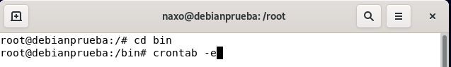

author: Ignacio Aragón Polo
id: Bastionado-GRUB
categories: Bastionado,GRUB,seguridad
environments: Web
status: Published

# Bastionado de GRUB

## Introducción
Duration: 0:04:00

### ¿Que es el GRUB?

Negative
: El **GRUB** o GRAnd Unified Bootloader, es un cargador de arranque multiple, desarrollado por el proyecto **GNU**, que nos permite elegir que Sistema Operativo arranca de los instalados.

Esta guia se va a centrar en las diferentes medidas y opciones de seguridad que disponemos para bastionar el arranque de un sistema **Debian**.

A continuacion trataremos los siguientes apartados que formarán nuestra guia:

* Encriptación de discos.
* Ocultacion del arranque.
* Contraseña de arranque.
* Copias de seguridad.

## Encriptación de discos.

Comenzaremos con la encripcion del disco duro, podremos hacerlo de modo guiado o bien de manera manual.

En esta ocasion seleccionaremos la opción guiada, usaremos todo el disco y lo cifraremos con el LVM.

Seleccionaremos el disco donde haremos la partición.

Le indicamos que lo haga en una sola partición.

A continuación nos solicitará guardar los cambios y configurar LVM (Gestor de Volumnes Lógicos).

Cuando concluya el proceso, tendremos que crear una contraseña robusta para el cifrado de la partición.

Seleccionamos todo el volumen para el particionado.

FInalmente nos mostrará un resumen de las particiones creadas y finalizamos el particionado y escribiremos los cambios en el disco.

Se nos preguntará para confirmar si continuamos con los cambios realizados. Pulsamos Si.

Con esto concluiria el particionado y encriptado de las particiones y comenzaríaa la instalacion del sistema.

## Ocultación del arranque.

Ahora configuraremos Debian para ocultar el arranque y que nopueda ser modificado.

Usando la terminal, en modo root, modificamos el archivo: "/etc/default/grub".

Aquí, modificaremos el tiempo que permitiremos que se vea el arranque del sistema. Para protegerlo, editaremos el archivo y modificamos la linea "GRUB_TIMEOUT" y escribiremos 0.

Una vez lo hayamos modificado, saldremos y guardamos, con ctrl+x y confirmamos.

Finalmente tendremos que actualizar el GRUB con el comando update_grub, para que se ejecute la modificacion de la configuración.

Tras esto quedará configurado el arranque de sistema que se ocultará en 0 segundos.

## Contraseña de arranque.

A continuación, pondremos una contraseña de arranque por seguridad.

Antes de empezar, con el comando "grub-mkpasswd-pbkdf2" encriptaremos la contraseña para aumentar la seguridad de la misma. Una vez nos genera la encriptscion la copiaremos.

Continuaremos configurando el archivo del GRUB, para asiganr una contraseña al arranque, con el comando "sudo nano /boot/grub/grub.cfg".

Ahora pondremos al usuario del sistema como root y justo debajo añadimos una linea con usuario y la contraseña encriptada para autenticarse cuando arranquemos el sistema.

Cuando iniciemos el sistema, nos pedirá autentificarnos para acceder al mismo.

## Copias de seguridad.

Ahora vamos a automatizar la creación de copias de seguridad de un directorio especifico. Para ello crearemos un script y utilizaremos y cofiguraremos **crontab**.

Para empezar, crearemos un directorio donde almacenaremos las copias de seguridad.

Continuamos accediendo al directorio bin y crearemos un archivo llamado "script-backup.sh" que será el que realice la copia de seguridad.

Una vez creado el archivo, le introduciremos las instrucciones que debe seguir y ejecutar. Añadiremos las siguientes instrucciones:
* cp -R → realizará una copia de lo que especifiquemos.
* /home/naxo/* → el directorio que queremos copiar.
* /backupfolder → el directorio de destino.

Una vez finalizado, tendremos que darle permisos de ejecución a nuestro script.

Actulizamos el sistema y descargamos la aplicación "crontab".

Configuramos la aplicación para que se ejecute en segundo plano.

Pasamos a configurar el crontab, para ello vamos a /bin y accedemos a la aplicación. 

Añadiremos la informacion para hacer las copias automáticas, cada dia a las doce de la noche.

Y así tenemos configurado nuestras copias de seguridad automaticas.